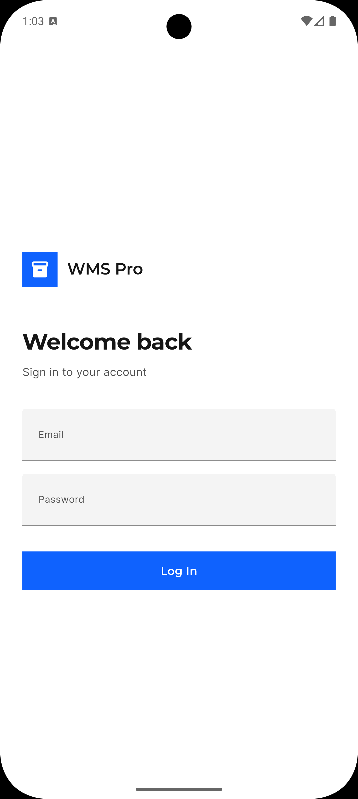
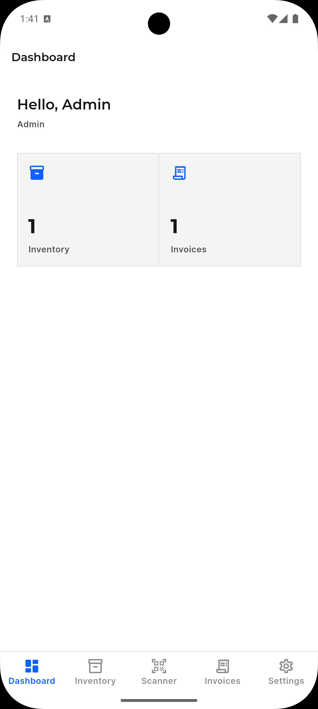
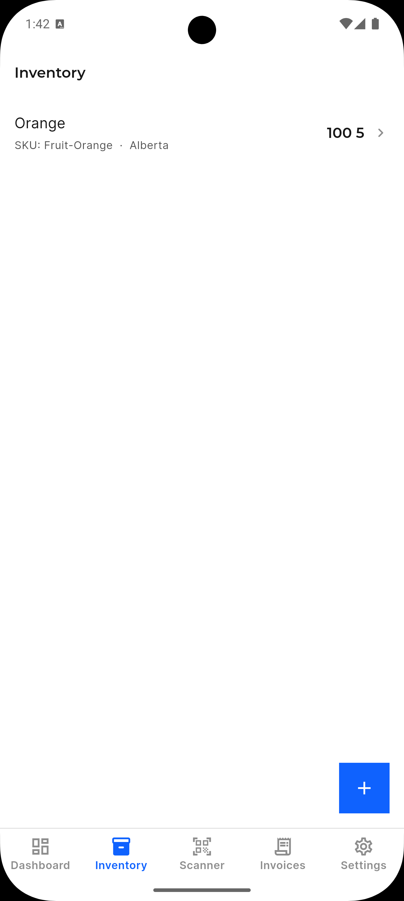
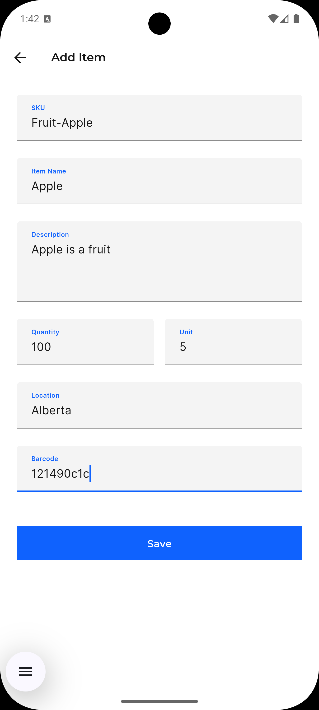
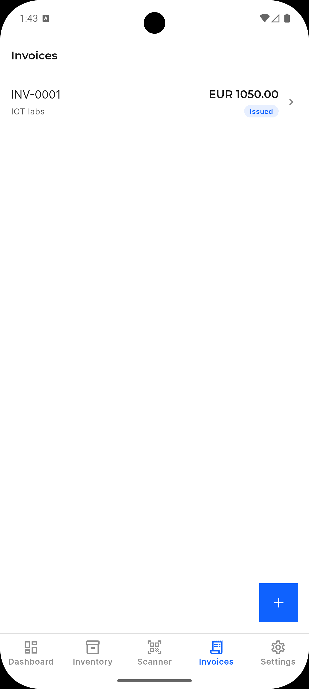
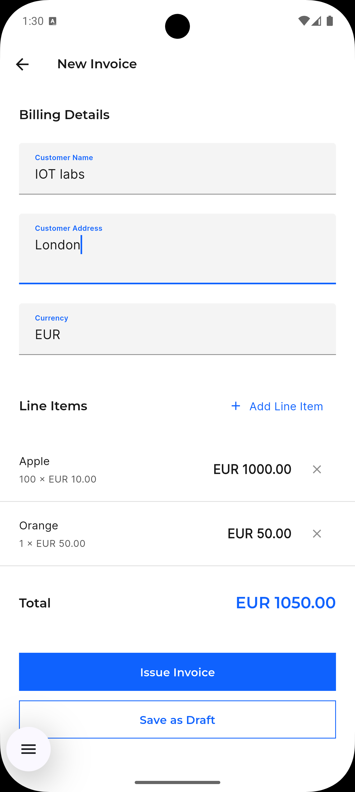
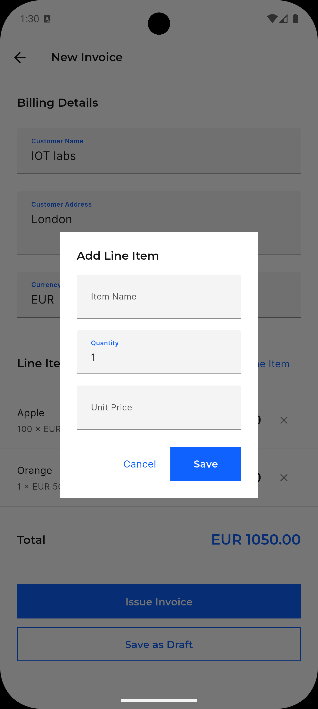
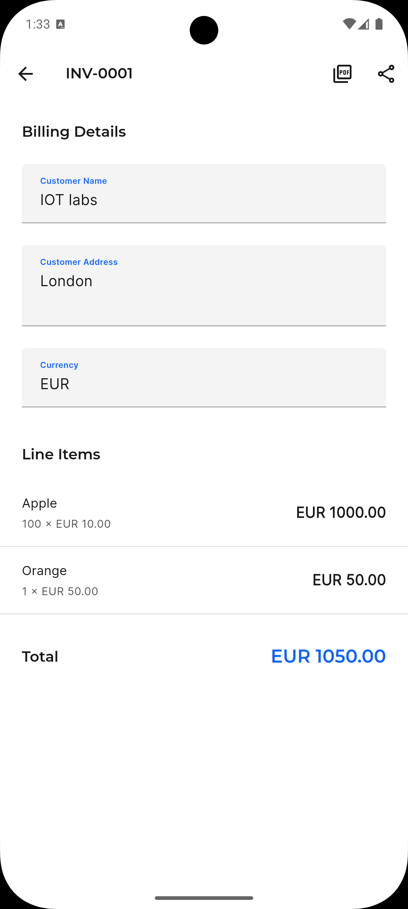
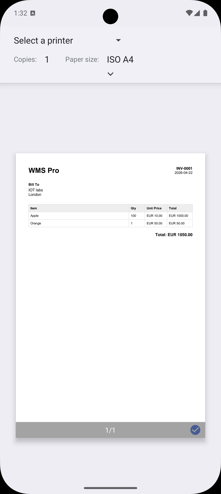
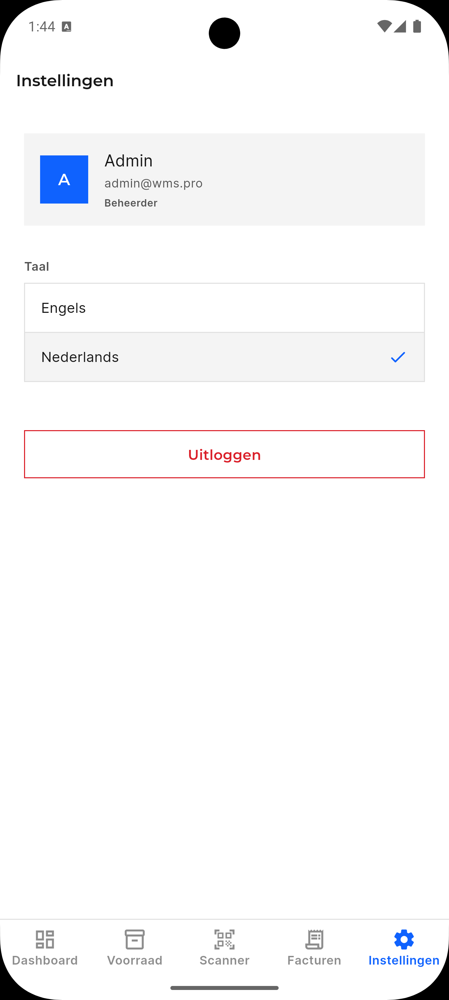

# WMS Pro

Warehouse inventory management with barcode scanning and PDF invoicing.

**Launch Fast. Scale Smart. Profit Early.**

---

## Overview

WMS Pro is a mobile-first warehouse management app built for in-house vendors and admins. It runs fully offline with optional future remote sync.

**Platform:** iOS & Android  
**Stack:** Flutter · GetX · Isar · mobile_scanner · pdf/printing  
**Locales:** English · Dutch

---

## Features

| Feature | Details |
|---------|---------|
| Role-based auth | Admin (full access) · Vendor (scan + invoice) |
| Inventory | Add/edit/delete stock items with SKU, barcode, location, quantity |
| Barcode scanner | Live camera scan → item lookup via Isar |
| Invoices | Create, issue, and share PDF invoices |
| Localization | EN / NL via ARB + flutter gen-l10n |
| Offline-first | Isar local DB; repository layer ready for remote sync |

---

## Getting Started

### Prerequisites

- Flutter 3.38+
- Dart 3.10+
- iOS 13+ or Android API 21+
- Physical device for scanner (camera not available on iOS Simulator)

### Setup

```bash
git clone https://github.com/aryanakul31/WMS-Pro.git
cd WMS-Pro
flutter pub get
dart run build_runner build --delete-conflicting-outputs
flutter gen-l10n
flutter run
```

### Default credentials

```
Email:    admin@wms.pro
Password: Admin@123
```

Change the admin password after first login.

---

## Architecture

```
lib/
├── core/
│   ├── constants/    app_constants.dart · app_routes.dart
│   ├── storage/      local_storage.dart (SharedPreferences wrapper)
│   ├── theme/        app_colors · app_text_styles · app_theme
│   └── routes.dart   GetX AppPages + bindings
├── features/
│   ├── auth/         Login · role-based session
│   ├── dashboard/    Stats overview
│   ├── inventory/    Stock items CRUD
│   ├── invoices/     Create · issue · PDF share
│   ├── scanner/      Live barcode/QR camera
│   ├── settings/     Language · logout
│   └── shell/        Bottom nav host
└── l10n/             app_en.arb · app_nl.arb
```

Each feature follows: `domain/` → `data/` → `presentation/` (GetX controller + page).

---

## Branches

| Branch | Purpose |
|--------|---------|
| `main` | Stable releases |
| `feature/UI` | Pixel-perfect UI — Deliverable 1 |

## Screens

### Auth & Dashboard



### Inventory



### Invoices






### Settings

